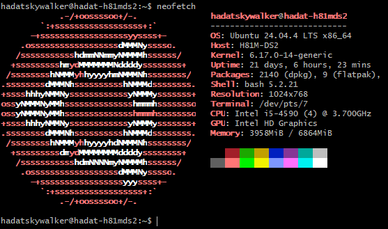
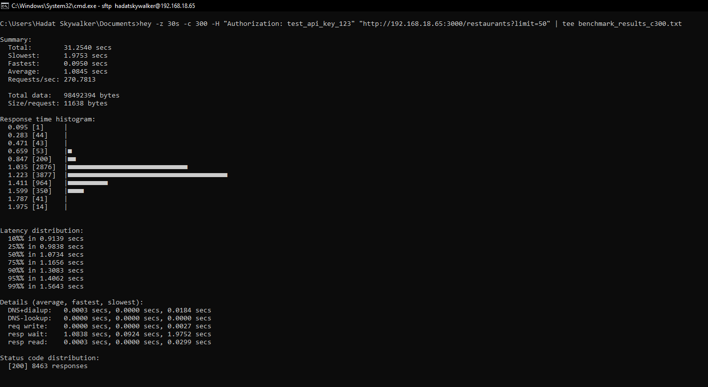

# Restaurant API: High-Performance Ruby on Rails Backend

A highly optimized, production-grade REST API built to handle massive concurrent traffic on legacy homelab hardware.

---

## AI Acceleration Disclaimer

*The development of this API was accelerated using **Google Antigravity AI**, demonstrating modern AI-assisted engineering workflows while maintaining strict architectural oversight.*

---

## Tech Stack & Key Features

**Core Stack:**
- **Ruby on Rails 7.x**
- **PostgreSQL**
- **Redis**
- **Docker**

**Advanced Features:**
- **Redis Entity Caching**: Drastically reduces database load by caching serialized JSON responses.
- **PostgreSQL Trigram (GIN) Indexing**: Powers lightning-fast, typo-tolerant full-text search capabilities.
- **Strict Cursor Pagination**: Ensures stable, scalable list endpoints without the performance degradation of offset-based pagination.
- **JWT with JTI Revocation**: Secure stateless authentication with the ability to instantly revoke active sessions.
- **Dual-Auth System**: Supports both Bearer Token (JWT for user sessions) and API Key (for service/M2M access) authentication.

---

## Getting Started

Get the API running locally in three easy steps.

**Step 1: Prerequisites**
Ensure you have **Ruby and Rails** and **Docker** installed on your system.

**Step 2: Start Containerized Services**
The database and cache ports are safely isolated in the `docker-compose.yml` file, and the Rails configuration is already mapped to them. Start the external services securely:
```bash
docker-compose up -d
```

**Step 3: Database Setup**
Prepare your local database schema and populate it with sample data:
```bash
rails db:migrate
rails db:seed
```
You can now start the Rails server with `rails s`.

---

## Performance & Stress Testing

This API was load-tested strictly on legacy 2014-era homelab hardware to prove the efficiency of the architecture.

### Hardware Specifications
*(Source: [homelab_specification.txt](./homelab_specification.txt))*


- **OS:** Ubuntu 24.04.4 LTS x86_64
- **Host:** H81M-DS2
- **CPU:** Intel i5-4590 (4 Cores) @ 3.700GHz
- **Memory:** 8GB (6864MiB total available) 

### Benchmark Results
*(Source: [benchmark_c300_result.txt](./benchmark_c300_result.txt))*

The load test was conducted against a paginated endpoint (`/restaurants?limit=50`). To ensure an accurate measurement of the server's raw performance, the load was generated from an independent machine (a separate laptop) over the local network. We used `hey` for this stress test because `k6` would be overkill for a quick solo performance verification.

#### Running the Test Locally with `hey`
To reproduce these results from your own machine targeting the server, you can use the `hey` HTTP load generator.
1. Install `hey` (e.g., `sudo apt install hey` or `brew install hey`).
2. Run the following command against your server's IP address to generate 300 concurrent requests for 30 seconds:

```bash
hey -z 30s -c 300 -H "Authorization: test_api_key_123" "http://192.168.18.65:3000/restaurants?limit=50"
```

**Results:**
- **Requests/sec:** 270.7813
- **Total Requests in 30s:** 8463
- **Success Rate:** 100% (8463 responses returned `[200 OK]`)
- **Fastest Response:** 0.0950 secs
- **Average Response:** 1.0845 secs

### Why is it so fast on old hardware?
The high throughput and perfect success rate handling 300 concurrent requests comes from **bypassing ActiveRecord entirely when possible using Redis entity caching**, and unlocking multi-threaded concurrency with fine-tuned **Puma worker threads**.

---

## API Documentation

A pre-configured Postman/Bruno JSON collection is available in the `/docs` folder. Import this collection into your preferred API client for immediate, ready-to-use local testing.

---

## Testing

The API is fully covered by a native **Minitest** suite, ensuring all CRUD operations, authentication filters, and pagination logic are mathematically proven to work without regressions.

To run the full test suite and verify functionality, execute:

```bash
rails test
```

For more detailed, verbose test output (which prints each test case name), run:

```bash
rails test -v
```
